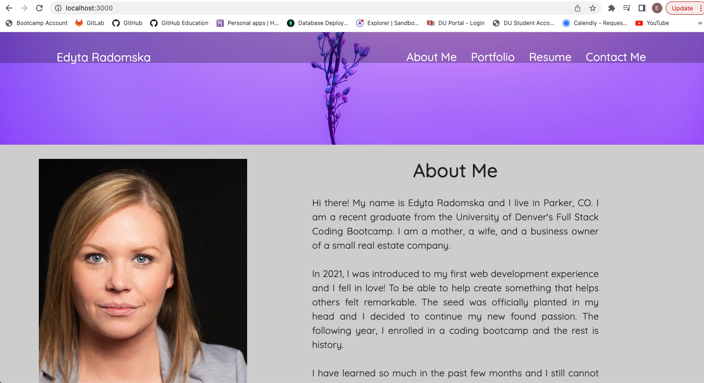
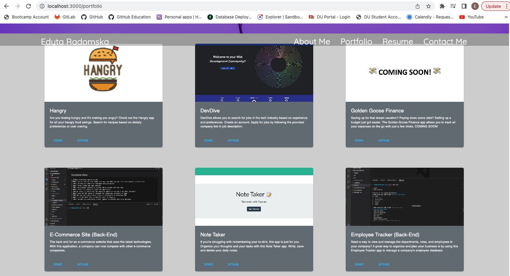
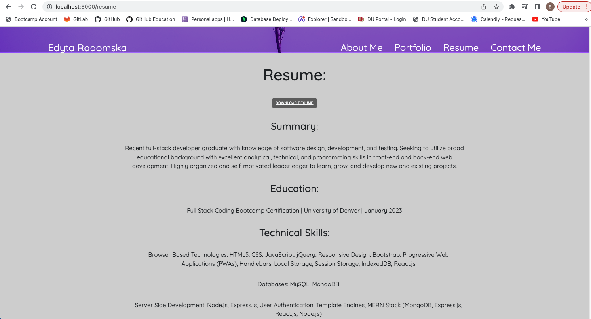
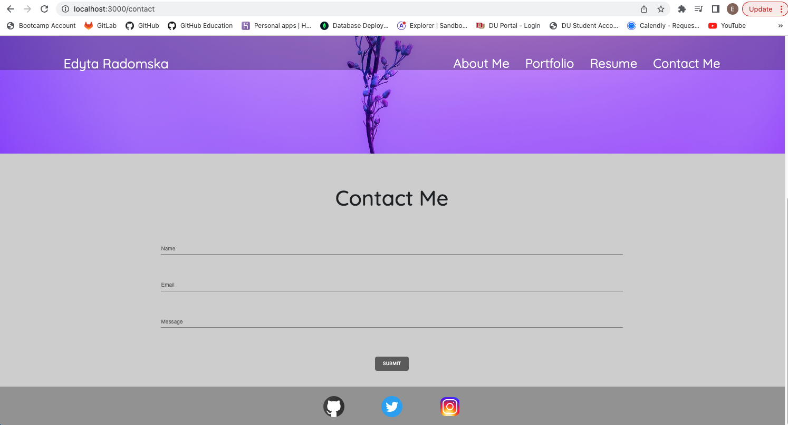

# React Portfolio

## Description

A professional portfolio using React to share projects with other developers, employers and clients.

## Table of Contents

- [Installation](#installation)
- [Usage](#usage)
- [Application Link](#application-link)
- [Mock-Up](#mock-up)
- [Questions](#questions)

## Installation

Use `create-react-app` to build the portfolio.

## Usage

Use `npm start` from the command line to start running the scripts in the package.json.

## Application Link

The following is a link to the deployed application:

[Edyta Radomska's Professional Portfolio](https://edyta0106.github.io/ReactPortfolio/)

## Mock-Up

The following sceenshots display the web application's appearance and functionality:

## Questions

[GitHub](https://github.com/edyta0106)

edyta0106@gmail.com

You can reach me at the email address listed above and I will get back to you as soon as I can.
